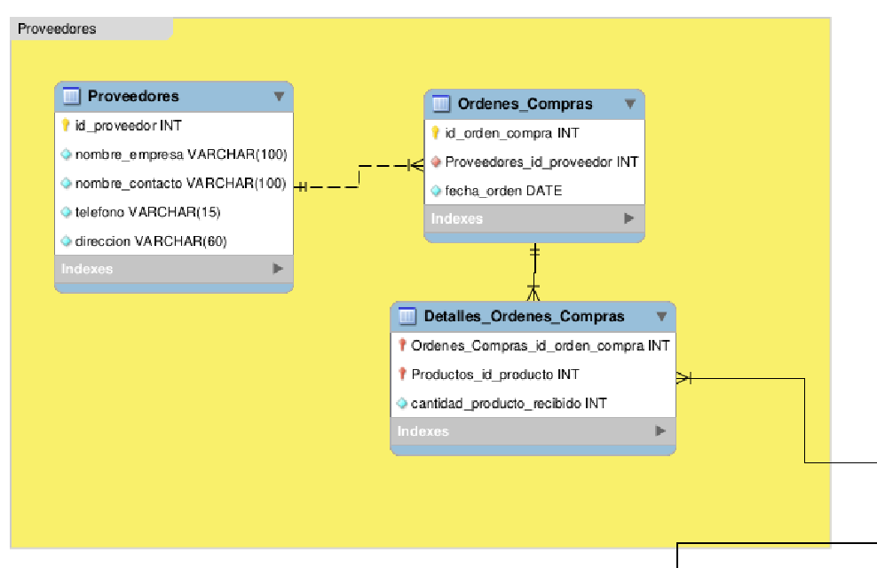
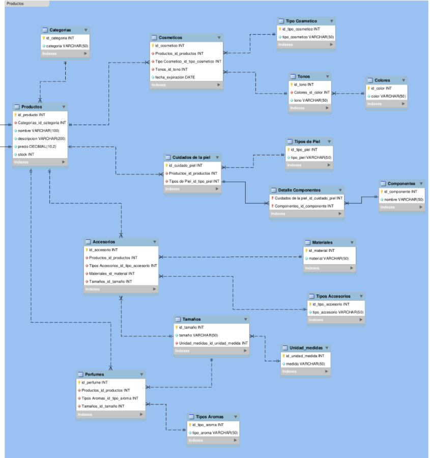
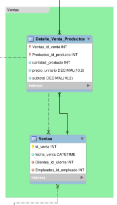
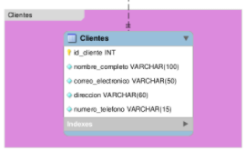
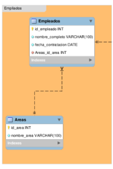

# Explicación del Diagrama UML ER

El **Diagrama UML ER** fue necesario como guía para diseñar y distribuir la base de datos de la tienda de maquillaje.

---

## Distribuciones

En la imagen se demuestra que la base de datos tiene distribuciones por colores para tener una mejor claridad.

| Nombre | Color | Tablas pertenecientes |
| :---: | :--- | :--- |
| Proveedores | Amarillo | `Proveedores`, `Ordenes_Compras`, `Detalles_Ordenes_Compras` |
| Productos | Azul | `Productos`, `Categorias`, `Cosmeticos`, `Tipo Cosmeticos`, `Tonos`, `Colores`, `Cuidados de la piel`, `Tipos de piel`, `Detalle Componentes`, `Componentes`, `Accesorios`, `Materiales`, `Tipos Accesorios`, `Tamaños`, `Unidad medidas`, `Perfumes`, `Tipos Aromas` |
| Ventas | Verde | `Ventas`, `Detalle_Venta_Productos` |
| Clientes | Morado | `Clientes` |
| Empleados | Naranja | `Empleados`, `Areas` |

## Imagenes de las Distribuciones

- **Distribución de proveedores**

    

- **Distribución deproductos**

    

- **Distribución de ventas**

    

- **Distribución de clientes**

    

- **Distribución de empliados**

    

---

## Tablas y Atributos

| Tabla | Atributos |
|---|---|
| Proveedores | `id_proveedor (PK)`, `nombre_empresa`, `nombre_contacto`, `telefono`, `direccion` |
| Ordenes_Compras | `id_orden_compra (PK)`, `Proveedores_id_proveedor (FK)`, `fecha_orden` |
| Detalles_Ordenes_Compras | `Ordenes_Compras_id_orden_compra (FK)`, `Productos_id_producto (FK)`, `cantidad_producto_recibido` |
| Empleados | `id_empleado (PK)`, `nombre_completo`, `fecha_contratacion`, `Areas_id_area (FK)` |
| Areas | `id_area (PK)`, `nombre_area` |
| Ventas | `id_venta (PK)`, `fecha_venta`, `Clientes_id_cliente (FK)`, `Empleados_id_empleado (FK)` |
| Detalle_Venta_Productos | `Ventas_id_venta (FK)`, `Productos_id_producto (FK)`, `cantidad_producto`, `precio_unitario`, `subtotal` |
| Clientes | `id_cliente (PK)`, `nombre_completo`, `correo_electronico`, `direccion`, `numero_telefono` |
| Categorias | `id_categoria (PK)`, `categoria` |
| Productos | `id_producto (PK)`, `Categorias_id_categoria (FK)`, `nombre`, `descripcion`, `precio`, `stock` |
| Cosmeticos | `id_cosmetico (PK)`, `Productos_id_productos (FK)`, `Tipo_Cosmetico_id_tipo_cosmetico (FK)`, `Tonos_id_tono (FK)`, `fecha_expiración` |
| Tipo Cosmetico | `id_tipo_cosmetico (PK)`, `tipo_cosmetico` |
| Tonos | `id_tono (PK)`, `Colores_id_color (FK)`, `tono` |
| Colores | `id_color (PK)`, `color` |
| Cuidados de la piel | `id_cuidado_piel (PK)`, `Productos_id_productos (FK)`, `Tipos_de_Piel_id_tipo_piel (FK)` |
| Tipos de Piel | `id_tipo_piel (PK)`, `tipo_piel` |
| Detalle Componentes | `Cuidados_de_la_piel_id_cuidado_piel (FK)`, `Componentes_id_componente (FK)` |
| Componentes | `id_componente (PK)`, `nombre` |
| Accesorios | `id_accesorio (PK)`, `Productos_id_productos (FK)`, `Tipos_Accesorios_id_tipo_accesorio (FK)`, `Materiales_id_material (FK)`, `Tamaños_id_tamaño (FK)` |
| Materiales | `id_material (PK)`, `material` |
| Tipos Accesorios | `id_tipo_accesorio (PK)`, `tipo_accesorio` |
| Tamaños | `id_tamaño (PK)`, `tamaño`, `Unidad_medidas_id_unidad_medida (FK)` |
| Unidad_medidas | `id_unidad_medida (PK)`, `medida` |
| Perfumes | `id_perfume (PK)`, `Productos_id_productos (FK)`, `Tipos_Aromas_id_tipo_aroma (FK)`, `Tamaños_id_tamaño (FK)` |
| Tipos Aromas | `id_tipo_aroma (PK)`, `tipo_aroma` |

---

## Estandares de tipo de datos para los atributos

| Tipo de dato | Atributos que lo tienen |
| :--- | :--- |
| INT | `IDs`, `cantidad`, `stock` |
| VARCHAR(100) | `nombres` |
| VARCHAR(15) | `numeros_telefonos` |
| VARCHAR(60) | `direcciones` |
| DATE | `fecha_orden`, `fecha_expiración`, `fecha_contratacion` |
| DATETIME | `fecha_venta` |
| VARCHAR(50) | Texto común y `correos` |
| DECIMAL(10,2) | `subtotal`, `precio`, `precio_unitario` |
| VARCHAR(200) | `descripciones` |
| VARCHAR(4) | `medidas` |

**¡Aclaración!** Para los números de teléfono se aceptan hasta 15 caracteres ya que es un estándar. Para confirmar este estándar, puedes ingresar a este link: [norma E.164](https://www.bandwidth.com/glossary/e164/)